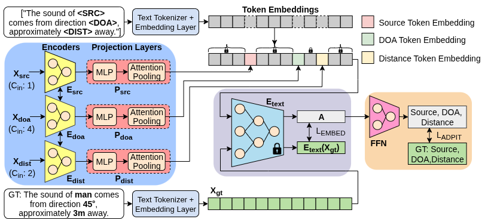

# TextEncodersForSELD

   <h2>
   Leveraging Pre-Trained Text Encoder for Sound Event Localization and Detection
   </h2>

## Key Idea:
We transform spectro-spatial features from multichannel audio into three token embeddings:  
   * Source token → captures event content 
   * DOA token → encodes directional cues
   * Distance token → represents source range \
These embeddings are inserted into randomly sampled natural language templates and passed through frozen text encoders (CLIP or BERT). The resulting embeddings are then used by a SELD prediction head to jointly estimate event activity, DOA, and distance.

## Abstract:
> Pre-trained language and multimodal models have emerged as powerful universal encoders, offering transferable embeddings that generalize effectively across diverse tasks. Although prior work has explored these models for spatial sound analysis, particularly in audio-visual contexts, their adaptation to sound event localization and detection (SELD) remains limited. In this paper, we leverage the representational power of large-scale pre-trained text encoders for SELD tasks. First, we transform spectro-spatial audio features from multichannel input into language-compatible token sequences. These comprise an audio token that captures event content, a direction-of-arrival (DOA) token representing directional cues, and a distance token capturing the source range. Subsequently, these tokens are processed by the text encoder to produce compact audio-driven embeddings that jointly capture event identity and spatial attributes. We evaluated our framework on the DCASE stereo SELD dataset, demonstrating consistent improvements over SELD baselines. In addition to improving SELD performance, the proposed framework produces embeddings that serve as structured representations for future multimodal extensions.

## Architecture:
<blockquote>

   
   	<figcaption>
	  	 Proposed audio-only SELD framework. Stereo audio features are mapped to three language compatible tokens (audio, DOA and distance) - which are processed by the frozen text encoder to generate an audio-driven embedding (\textbf{A}) which serves as a compact representation of both the event identity and its spatial attributes.
    	</figcaption>

 

* Three main components are involved in the proposed SELD framework: 
   1. A tokenizer (shaded blue) that transforms spectro-spatial features into language compatible tokens
   2. A pretrained text encoder (shaded purple) that produces audio-driven embeddings
   3. A SELD prediction head (shaded peach) that takes the audio-driven embedding as  input and predicts the source event and its spatial attributes.

Components Description:
   * Tokenizer: 
      * This module consists: a source tokenzier for capturing the source event name, a DOA tokenzier for capturing the direction of arrival, and a distance tokenzier for capturing the source range. 
      * Each tokenizer has a feature encoder layer followed by a projection layer.
      * To encode event-identity features ($X_{\text{src}}$), we explore two alternatives for the source encoder ($E_{\text{src}}$): \
         (i) BEATs: a transformer-based network BEATs pre-trained in self-supervised manner and \
         (ii) RCC: a Residual-based CNN-Conformer network.
      * Directional ($E_\text{doa}$) and distance ($E_\text{dist}$) encoders are based on the RCC network.
      * BEATs: CNN kernel size and stride is modified to $(5, 16)$; we train the weights of CNN and projection head, while keeping the transfomer block frozen.
      * RCC: Comprises of $4$ CNN blocks with residual connections, followed by $2$ conformer blocks; Each CNN blocks comprises of main branch with two CNN-BN-ReLU layer (kernel size: $(3, 3)) and a single CNN-BN layer (kernel size: $(1, 1)$) in a residual branch; their outputs are summed and followed by average pooling.
      * Additionally, a shared component comprising two conformer blocks is employed as a multi-feature attention layer. This layer jointly process the intermediate source, DOA, and distance features when $E_\text{src}$ is RCC; otherwise, it operates only on the DOA and distance features.
      * Segment embeddings are added to each features prior to the multi-feature attention block.
      * The resulting outputs are then passed through respective projection layers, $P_\text{audio}$, $P_\text{doa}$ and $P_\text{dist}$. Each projection layer consists of MLP followed by an attentive pooling layer. The dimension of the output of each projection layer is $\text{embed-dim} = 512$.
   * Text encoder:
      * We explore two distinct frozen pre-trained text encoders: CLIP and BERT ($\text{embed-dim} = 512$).
      * Processes structured text templates containing token embeddings.
   * SELD prediction head: 
      * 2 variants:
         * GREP (Global Representation Prediction) – Uses [EOT]/[CLS] token embedding (called as audio-driven embedding ($\mathbf{A}$)).
         * TREP (Token Representation Prediction) – Concatenates the source, DOA, and distance token embeddings of contextualized last hidden state of the text encoder.

Overall Configurations: A total of $8$ model configurations are evaluated, formed by the combinations of:
   * Source encoder: BEATs or RCC
   * Text encoder: CLIP or BERT
   * Prediction head: GREP or TREP

      | Source Encoder | Text Encoder | Prediction Head | Model Name      |
      | -------------- | ------------ | --------------- | --------------- |
      | BEATs          | CLIP         | GREP            | BEATs-CLIP-GREP |
      | BEATs          | BERT         | GREP            | BEATs-BERT-GREP |
      | RCC            | CLIP         | GREP            | RCC-CLIP-GREP   |
      | RCC            | BERT         | GREP            | RCC-BERT-GREP   |
      | BEATs          | CLIP         | TREP            | BEATs-CLIP-TREP |
      | BEATs          | BERT         | TREP            | BEATs-BERT-TREP |
      | RCC            | CLIP         | TREP            | RCC-CLIP-TREP   |
      | RCC            | BERT         | TREP            | RCC-BERT-TREP   |

</blockquote>

## Loss functions
<blockquote>
The model is trained in a supervised manner with two objectives: \
   (i) aligning the audio-driven embeddings ($\mathbf{A}$) with the ground-truth text embeddings ($E_\text{text}(X_\text{gt})$), and \
   (ii) predicting active source, DOA and distance in the multi-ACCDOA format.
   
The mean absolute error (MAE) is used to align the audio-driven embeddings with ground-truth text embedding, and the Auxiliary Duplicating Permutation Invariant Training (ADPIT) loss ($L_\text{ADPIT}$) for multi-track activity/DOA/distance prediction. In our implementation, the per output regression term inside ADPIT is the mean squared error (MSE) over DOA and distance predictions.
</blockquote>

